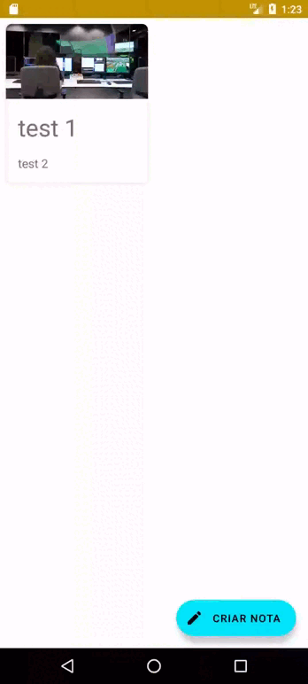

# Ceep

App Android de bloco de notas aplicando comunicação com Web Api

## 🔨 Funcionalidades do projeto

O projeto permite cadastrar, alterar e remover blocos de notas com persistência de dados via internet com Web Api .

- Criando uma nota



<hr>

## ✔️ Técnicas e tecnologias utilizadas

- `Web API`: Reduzindo as chances de um aplicativo perder dados por motivos de desinstalação, formatação e perda do dispositivo
- `Retrofit`: é uma biblioteca para Android que simplifica a realização de comunicações HTTP em aplicativos, facilitando a criação de clientes RESTful e a conversão de dados recebidos em objetos Java/Kotlin.
- `UUID`: é um identificador único utilizado em comunicações entre aplicações distintas para garantir que cada entidade tenha um identificador único e globalmente reconhecido.
- `Jetpack Room`: lib para persistência de dados em banco de dados interno com SQLite
- `Entidade`: definição da tabela que será criada no banco de dados
- `Database`: configuração para criar a conexão com o banco de dados
- `Coroutines`: Estrutura para escrever código assíncrono de forma concisa e legível em Kotlin, evitando bloqueios de thread

<hr>

## 🛠️ Abrir e rodar o projeto

- Abrir o projeto no Android Studio

- Para fazer a conexão com a Web Api é preciso utilizar um servidor externo <a href="https://github.com/alura-cursos/ceep-web-api/releases/download/0.0.1/server.jar">server.jar</a>.

- Após o download, mantenha o arquivo server.jar em um diretório/pasta de sua preferência e que você tenha privilégios de execução.

- Em seguida, a partir de um terminal ou prompt de comando, acesse o diretório/pasta onde o arquivo server.jar está e rode o seguinte comando ```java -jar server.jar.```

- Para testar a Web API, acesse o endereço ```http://localhost:8080``` ou utilizar o Postman com as seguintes requisições: 
    - **GET**:  localhost:8080/notas 
    - **POST**:  localhost:8080/notas 
    - **PUT**:  localhost:8080/notas 
    - **DELETE**:  localhost:8080/notas 

<hr>

## 🤝 Contribuições

- Contribuições são bem-vindas! Sinta-se à vontade para abrir problemas, propor melhorias ou enviar solicitações de pull.
<hr>

[](https://www.linkedin.com/in/jeancarlotorre619b/)

⭐️ Star o projeto

🐛 Encontrar e relatar issues
